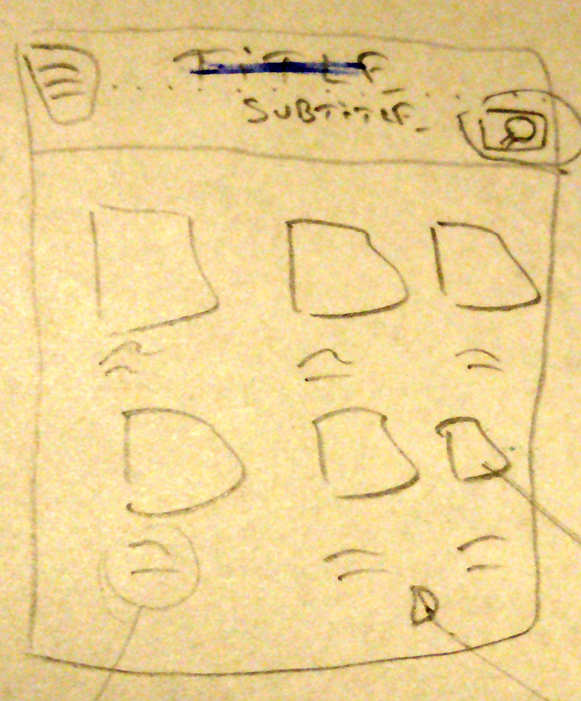
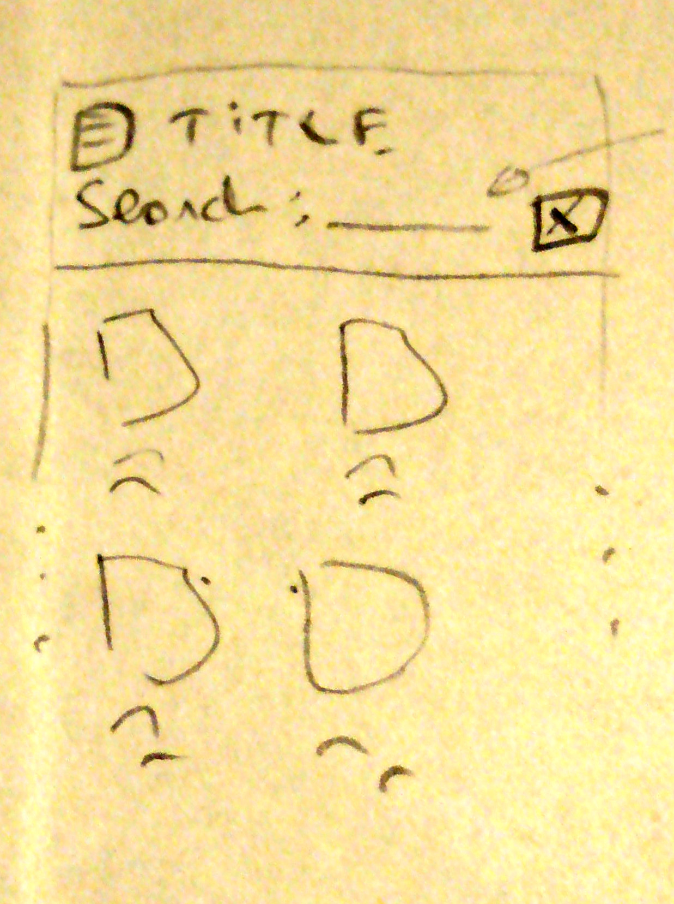
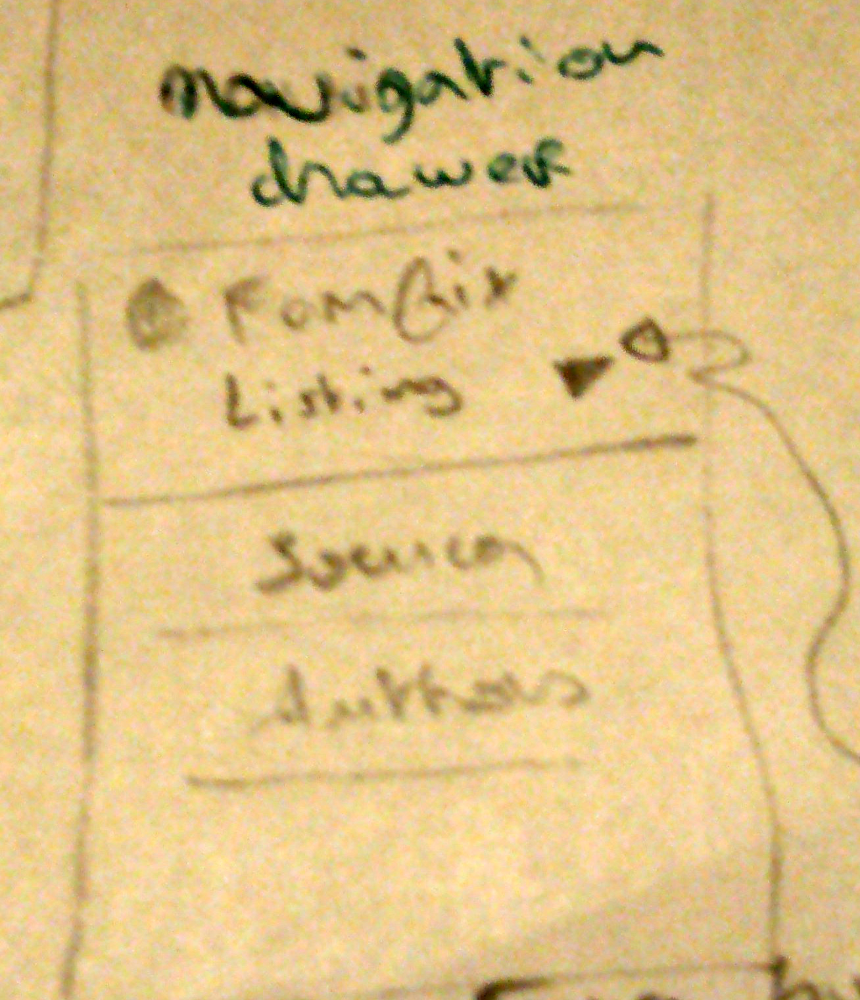
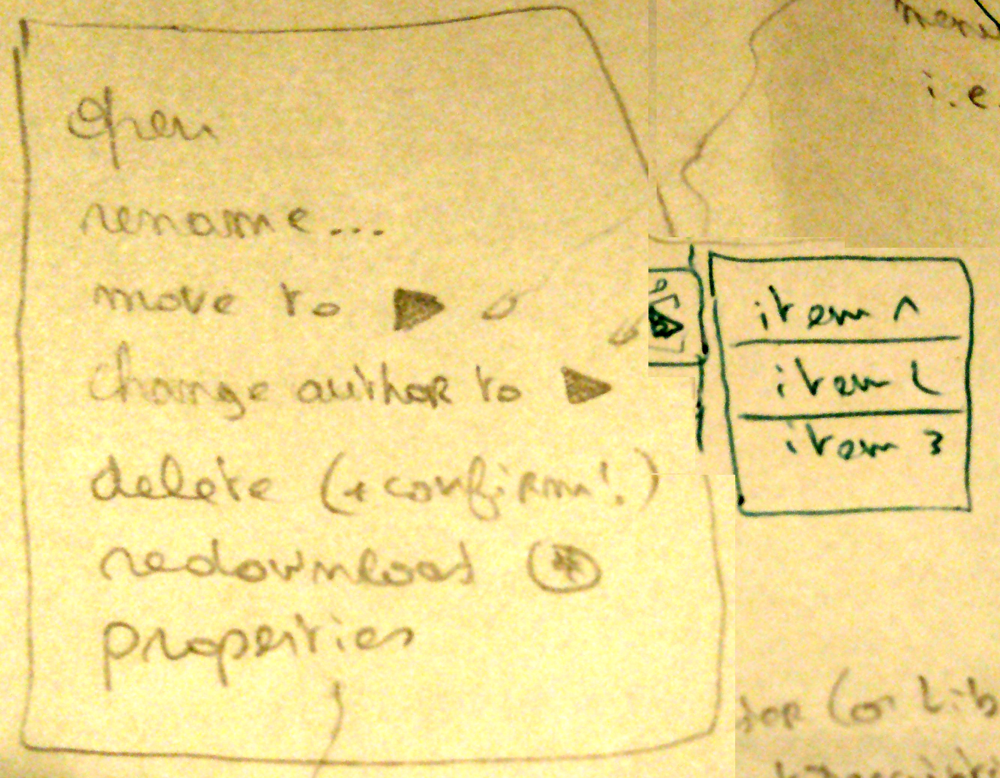
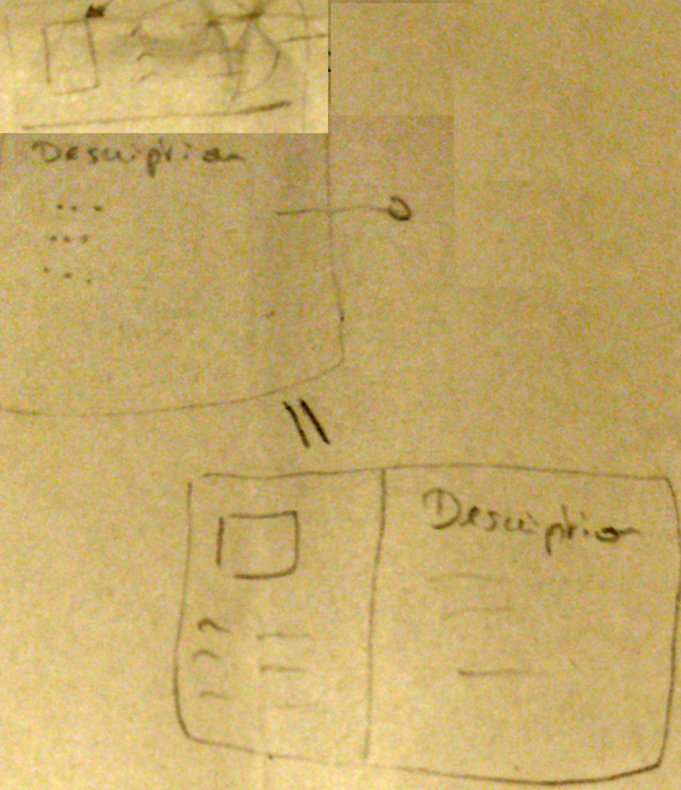
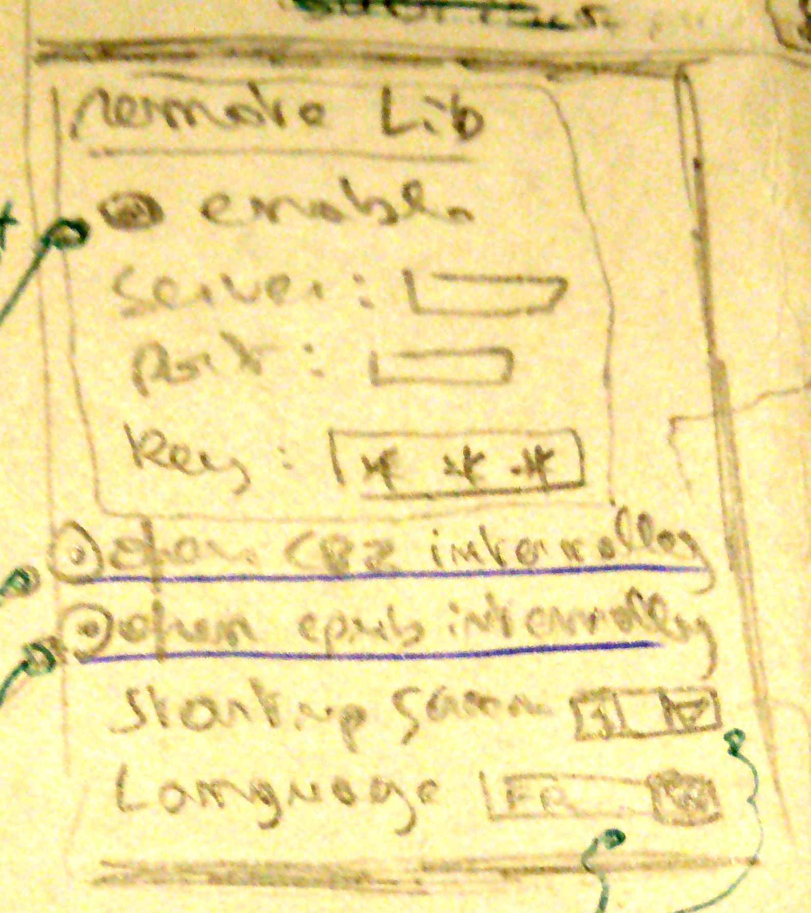
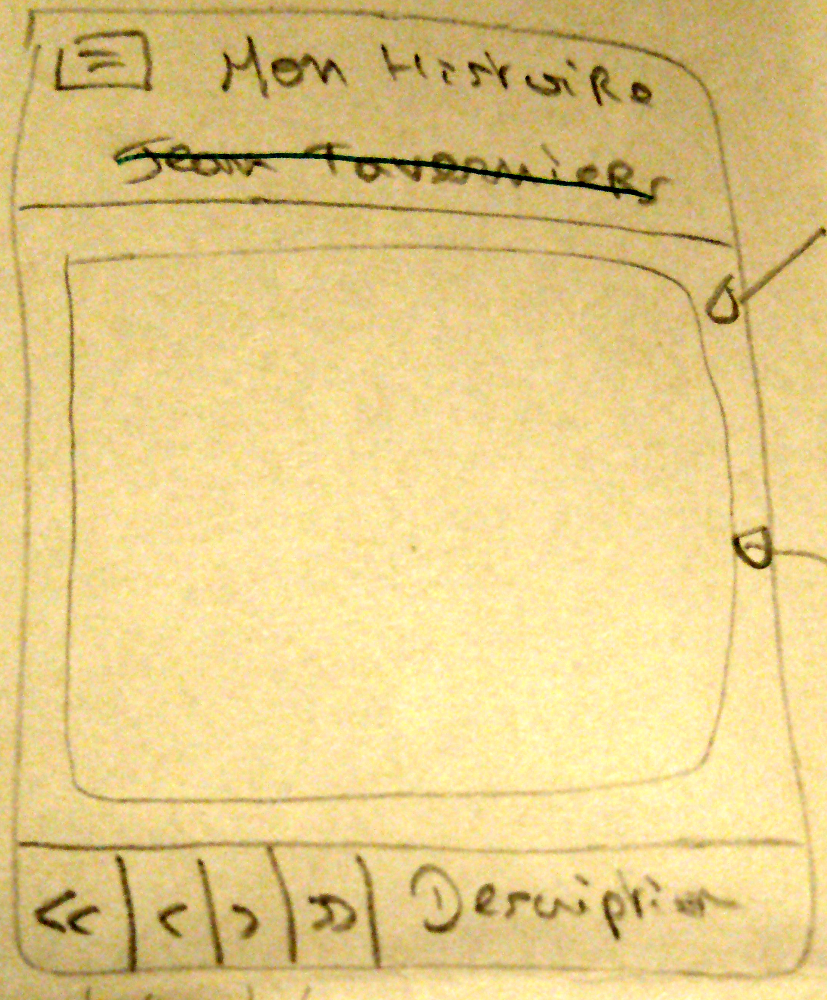
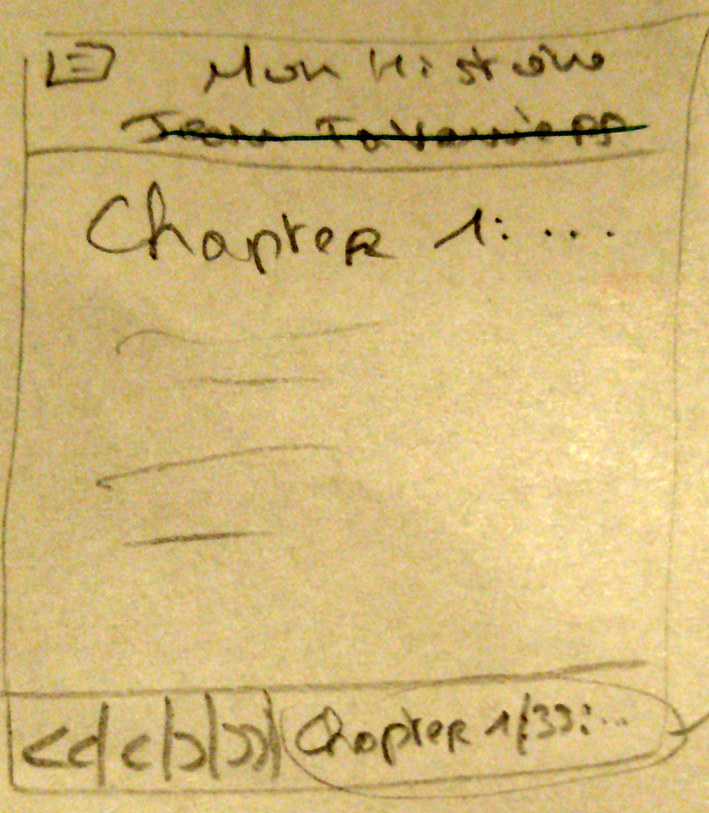
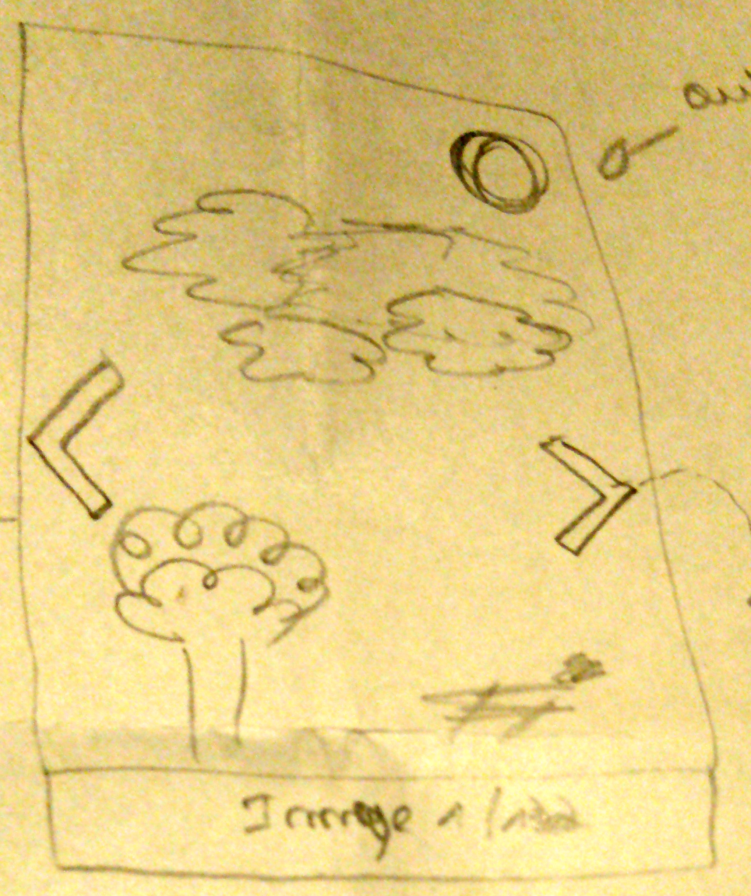

# Android UI mock-up

## Concepts

### Story

We have **Stories** in Fanfix, which represent a story (an "epub", ...) or a comics (a "CBZ" file, ...).

A story is written by an author, comes from a source and is dentified by a LUID (Local Unique ID).
It can be a text story or an image story.

The source can actually be changed by the user (this is the main sorting key).

### Book

We also have **Books**.

Books can be used to display:

- All the sources present in the library
- All the authors known in the lbrary
- Stories sharing a source or an author

### All and Listing modes

When representing sources or authors, books can be arranged in two modes:

- "All" mode     : all the sources/authors are represented by a book and displayed in the UI
- "Listing" mode : for each source/author, a group of books representing the corresponding story is present with the name of the source/author to group them (for instance, a JLabel on top of the group)

Note: Listing mode can be left out of the Android version if needed (but the all mode is really needed).

### Destination

What I call here a destination is a specific group of books.

Examples :

- All the sources
- All the books of author "Tulipe, F."
- A listing of all the authors and their stories

## Core

### Library (main screen)

#### Header

The header has a title, a navigation icon on the left and a search icon.

Title can vary upon the current displayed books:

- All sources
- Sources listing
- Source: xxx
- All authors
- Authors listing
- Author: xxx

The navigation icon open the Navigation drawer.

##### Search

The search icon is actually a filter: it will hide all the books that don't contain the given text (search on LUID, title and author).

#### List

This list will hold books. Each item will be represented by :

- a cover image (which is provided by fanfix.jar)
- a main info, which can be:
  - for stories, the story title
  - for source books, the source name
  - for author books, the author name
- a secondary info, which can vary via a setting (see the Options page) between:
  - author name (for a book representing an author, it is left blank)
  - a count (a word count for text stories, an image count for images stories, a stories count for sources and authors books)

#### UI

Material.IO:

- Title, navigation icon, search icon : [App bar top](https://material.io/design/components/app-bars-top.html)
- List                                : [Cards](https://material.io/design/components/cards.html)

A tap will open the target book in full-screen mode (i.e., the details about the card).

On the detailed card, you will see the description (see Description Page) and 3 buttons :

- Open
- Delete
- "..." for a menu

### Navigation drawer

The navigation drawer will list 4 destinations:

- All the sources
- Listing of the sources
- All the authors
- Listing of the authors
- By source

...and 2 foldable "panels" with more destinations:

- By source
- By author

Those subpanels will either contain the sources/authors **or** sub-subpanels with sources/authors.
See fanfix.jar (BasicLibrary.getSourcesGrouped() and BasicLibrary.getAuthorsGrouped()).

Note: if those last two cause problems, they can be removed; the first four options would be enough to cover the main use cases.

#### UI

Material.IO:

- Navigation drawer: navigation drawer

### Context menu

The context menu options are as follow for stories:

- Open                : open the book (= internal or external reader)
- Rename...           : ask the user for a new title for the story (default is current name)
- Move to >>          : show a "new source..." option as well as the current ones fo quick select (BasicLibrary.getSourcesGrouped() will return all the sources on only one level if their number is small enough)
  - *
    - [new source...]
  - [A-H]
    - Anima
    - Fanfiction.NET
  - [I-Z]
    - MangaFox
- Change author to >> : show a "new author..." option as well as the current ones fo quick select (BasicLibrary.getAuthorsGrouped() will return all the authors on only one level if their number is small enough)
  - *
    - [new author...]
  - [0-9]
    - 5-stars
  - [A-H]
    - Albert
    - Béatrice
    - Hakan
  - [I-Z]
    - Irma
    - Zoul
- Delete              : delete the story
- Redownload          : redownload the story (will **not** delete the original)
- Properties          : open the properties page

For other books (sources and authors):

- Open: open the book (= go to the selected destination)

#### UI

Material.IO:

- menu: [menu](https://developer.android.com/guide/topics/ui/menus.html)

The menu will NOT use sublevels but link to a [list](https://material.io/design/components/lists.html) instead.

### Description page

#### Header

Use the same cover image as the books, and the description key/values comes from BasicReader.getMetaDesc(MetaData).

#### Description

Simply display Story.getMeta().getResume(), without adding the chapter number (it is always 0 for description).

An example can be seen in be.nikiroo.fanfix.ui.GuiReaderViewerTextOutput.java.

### Options page

It consists of a "Remote Library" panel:

- enable : an option to enable/disable the remote library (if disabled, use the local library instead)
- server : (only enabled if the remote library is) the remote server host
- port   : (only enabled if the remote library is) the remote server port
- key    : (only enabled if the remote library is) the remote server secret key

...and 5 other options:

- Open CBZ files internally    : open CBZ files with the internal viewer
- Open epub files internally   : open EPUB files with the internal viewer
- Show handles on image viewer : can hide the handles used as cues in the image viewer to know where to click
- Startup screen               : select the destination to show on application startup
- Language                     : select the language to use

#### Startup screen

Can be:

- Sources
  - All
  - Listing
- Authors
  - All
  - Listing

...but will have to be presented in a better way to the user (i.e., better names).

#### UI

Material.IO:

- the page itself     : Temporary UI Region
- the options         : Switch
- the languages       : Exposed Dropdown Menu
- the text fields     : the default for text fields
- the scret key field : the default for passwords (with * * * )

## Internal viewer

The program will have an internal viewer that will be able to display the 2 kinds of stories (images and text).

### Base viewer

This is common to both of the viewer (this is **not** an architectural directives, I only speak about the concept here).

#### Header

The title is the title of the story, shortened with "..." if too long.

#### Content

This area will host the text viewer or the image viewer.

#### Navigator

It contains 4 action buttons (first, previous, next and last chapter) and the title of the current chapter:

- Descripton         : for the properties page (same layout as the actual Properties page)
- Chapter X/Y: title : for the normal chapters (note that "Chapter X/Y" should be bold, and "X" should be coloured)

#### UI

Matrial.IO:

- Header    : Header
- Navigator : [Sheets bottom](https://material.io/design/components/sheets-bottom.html)

### Text viewer

It will contain the content of the current chapter (Story.getChapters().get(index - 1)).

Same layout as the Properties page uses for the resume, with just a small difference: the chapter name is now prefixed by "Chaper X: ".

### Image viewer

#### Image

Auto-zoom and fit (keep aspect ratio).

#### Image counter

Just display "Image X/Y"

#### Handles

This is a simple cue to show the user where to click.

It can be hidden via the option "Show handles on image viewer" from the Options page.

#### UI

Pinch & Zoom should be allowed.

Drag-to-pan should be allowed.

