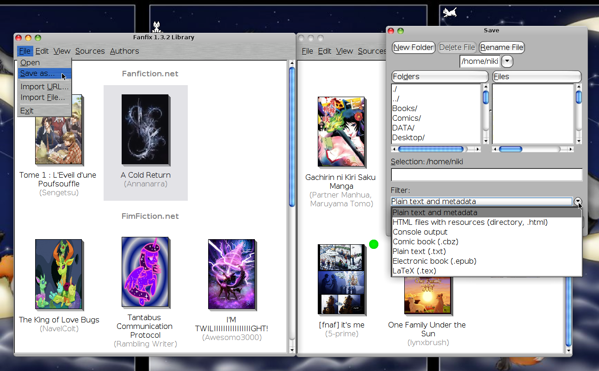
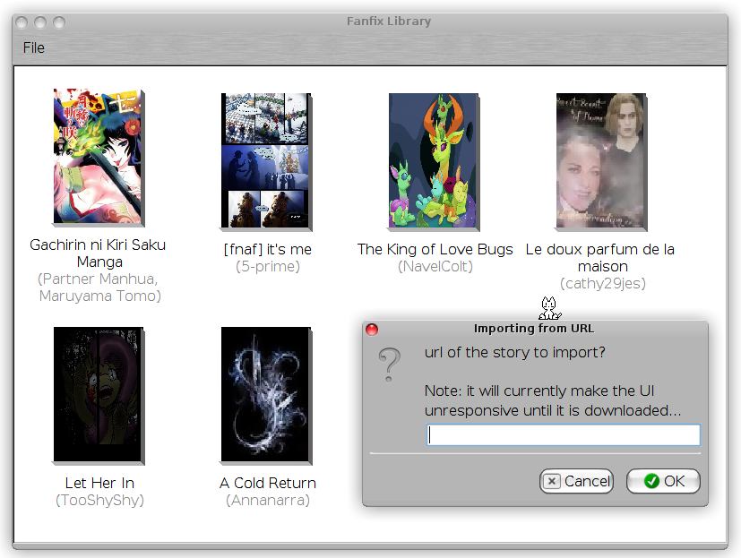

# Fanfix

## Screenshots

Fanfix peut utiliser plusieurs interfaces :

- GUI: une interface basée sur Swing, pour afficher le programme sur votre PC graphiquement
- TUI: une interface basée sur [jexer](https://gitlab.com/klamonte/jexer/), pour afficher des fenêtre et des boutons en mode texte
- CLI: une interface purement en lignes de commandes, facile à automatiser dans un script ou pour utiliser dans un terminal texte

Cette gallerie reprend des screenshots de plusieurs versions de Fanfix, mais les versions les plus récentes sont affichées en premier.

### Version 1.9.0

#### GUI

#### TUI

#### CLI

### Version 1.3.2

#### GUI

### Version 1.0.0

#### GUI

